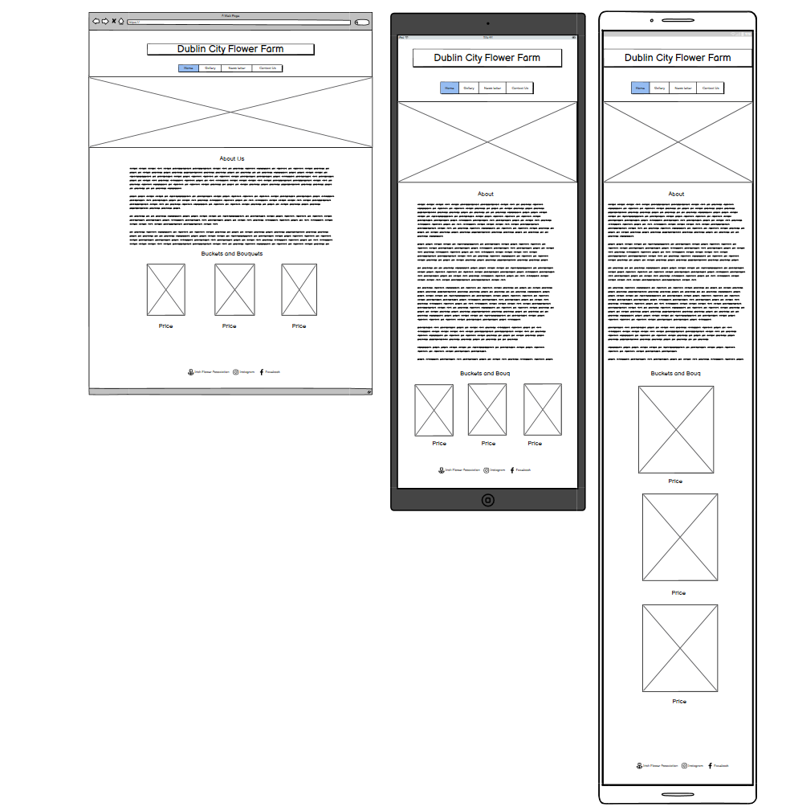
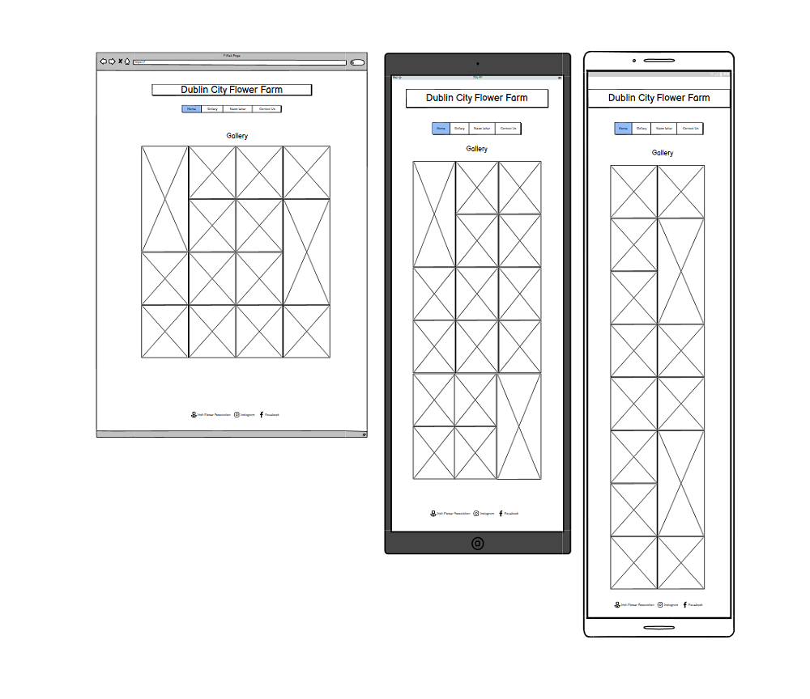
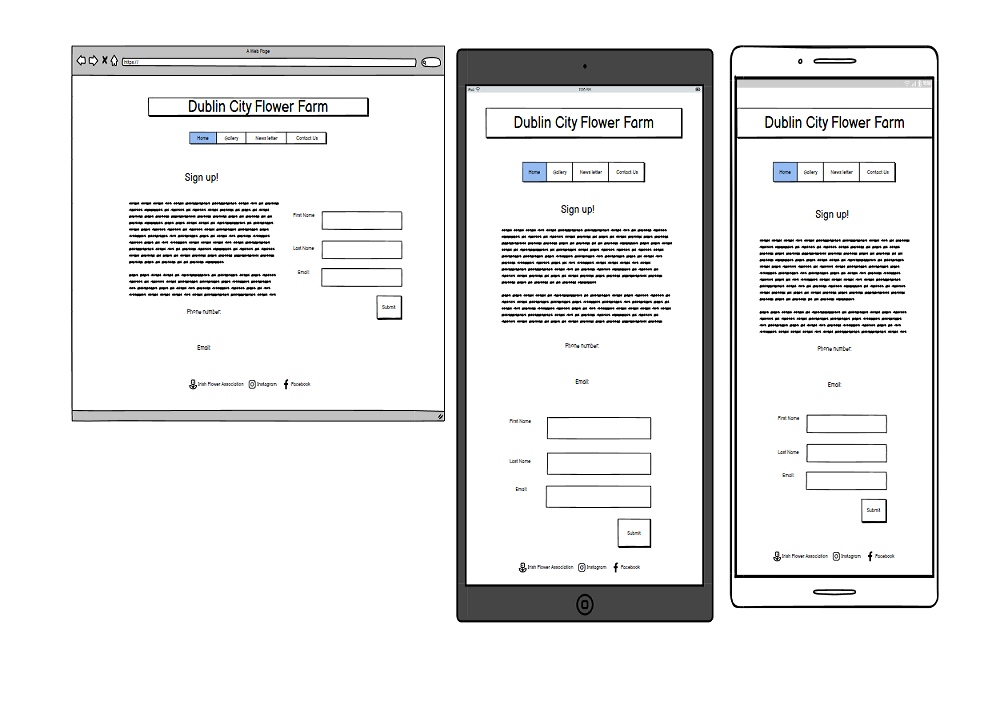
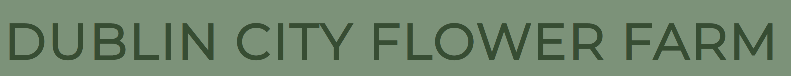
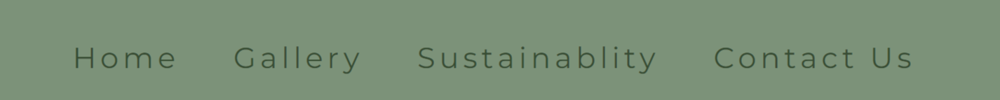
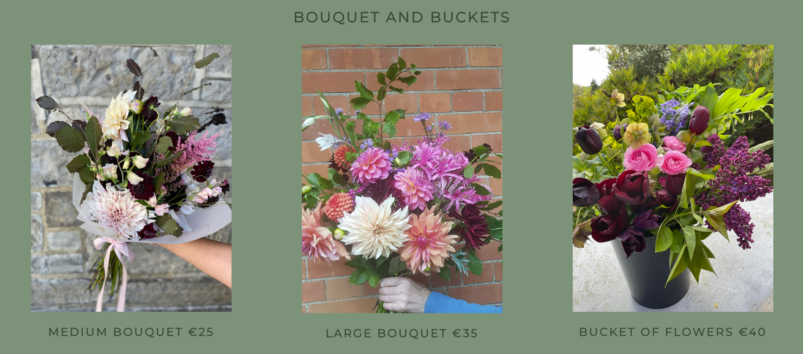
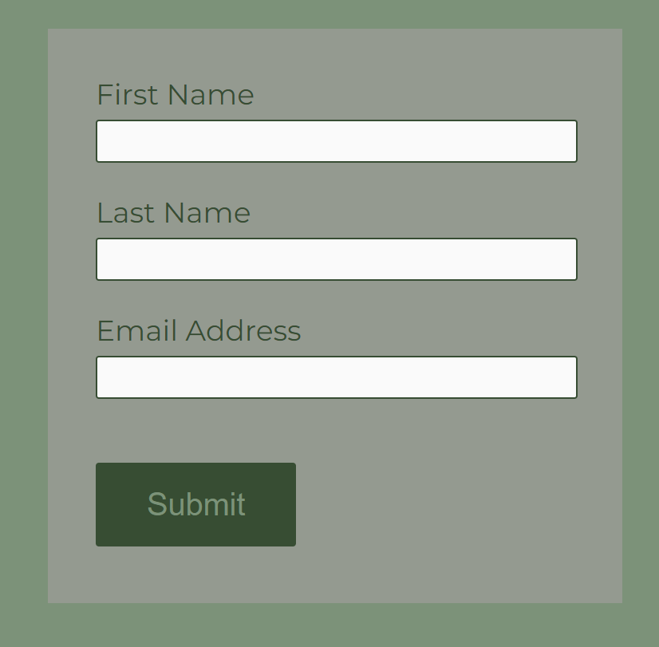
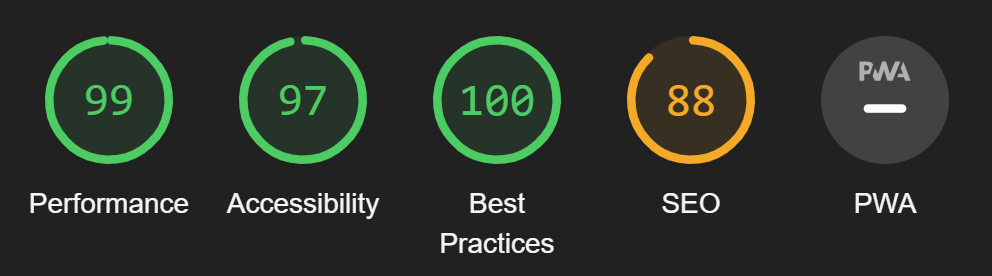

# Dublin City Flower Farm

Dublin city flower farm is a site dedicated to helping the user to get a feel for the kind of servis that the Dublin flower farm provides. The site will target flourist and regular punters to see what is avalible throughtout the year. the site will also give the users some information about who the company is and what they stands for. The site is also about networking and making conections with people, as the gardening world is a large place it can be hard to find contacts.

# UX

As a new visitor to the site I would like information on what the company is about. what are the companys products and why should we choies them. As a returning custamer i want to be easly able to navigate the site to easly fine what I'm looking for and possable give feedback to the host.

# Design (UXD)

The User Experience Design was constructed using the five planes. 
+ Stratagy: Is this content relvent to the user and is it culturally appropriate.
+ Scope: Are we accomplishing our goals of broadcasting the companys ethos and products.
+ Structure: How many pages should we have in our web page and why?
+ skeleton: Does the structure of the wireframe meet the costumers/Users needs. is the web page responsive.    
+ Surface: Does the site visully look good does it have enough images and colours.

# Features 

## Logo

The logo give the user a clear indaction of what the site is and who it caters for. Clicking on the logo will also return you to the home page.

## Navagation bar

The navigation bar features on all four pages and is fully responsive. The logo also has a link to the home page when you click on it. The navigation bar is exactly the same on all pages to make the site more welcomeing and intuative. this section will alow the user to navagate throught the website without having to use the back botton.

## Homepage image

the Homepage image with overlay text is there to draw your eye to the contnt of the image to give the user and idea of what on offer. The overlay text give us a quout to try and better gage the site.

## Bouquets and buckets

Bouquets and buckets section of the page lets the user see what the website has to offer in turms of what they are selling.

## Footer

The footer includes links to socil media that encourges the user to connect with the other platforms to better stay connect with the website. the links to the social media open up in new tabs to allow ease of navigation.

## Gallery Page

The gallery will give the user a valuble insite into what the Dublin city flower farm has to offewr in term of stock. and how the flowers are grown.

## Sustainablity Page

Sustainablity page give the user an insite into why you should buy flowers localy and not from abroad (Not from the Netherlands). the vidoe on this page is a look into the flower farm natural and sustainablity way to farm flower.

## Contact Us Page

The contect us page lets you sign up to the news letter using the from. Witch will give the user a seasonal stock update and new of how the season is going. this page also gives users contect infermation for inquers.

## Features to be added

A feature that will be added is the ablity to place orders by clicking on the images of the differnt products avalable and a way to pay on the site.

## Testing

+ I tested this web page works on differnt browers, Edge, Chrome, Firefox and Safari.
+ The web page is responsive and looks great on all standard screen sizes using Devtools on google Chrome.
+ I have made sure that all my heading and text are easy to read and easy to understand.
+ I can confirm that the vidoe does not auto play.
+ I can confirm that my form requires first name last name and an email adrress to be entered before it will be excepted.

## Bugs

When i deploy my project to Github the images where not displaying.
+ I had to go back and change my file path diriectory and it worked!

## Validation Testing

HTML
+ No errors were found when passing the web page through the official W3C Validator.

CSS
+ No errors were found when passing the web page through the official Jigsaw Validator.

Accessibility score
+ The color and the font have good contrast and are easly readable as you can see by the 97% Accessibility score from Lighthouse in devtools.

## Deployment

The site was deployed using Github pages:
+ Go to github repositorys, click on the settings tab.
+ Click on pages in the bar on the left hand side.
+ Click on Branchs makes sure it set to main and click save.
+ Refresh the page and you will see a URL link to your page.

https://brionconroy.github.io/G_flower_shop/

## Credits

+ Thanks to the tutors at Coding instatute and to my mentors Anthony for guiding me throught my first project.

## Content
+ My gallery and form framework was taken from love running project.
+ My icons where taken from [Font Aswome](https://fontawesome.com/)
+ My font was taken from [Google Fonts](https://fonts.google.com/)
+ All my text content was writen by the client.
+ Making my web page more responsive. [Youtube](https://www.youtube.com/watch?v=WAIfQOR9bh4)

## Media 

+ All images and videos where given to my by the client.

