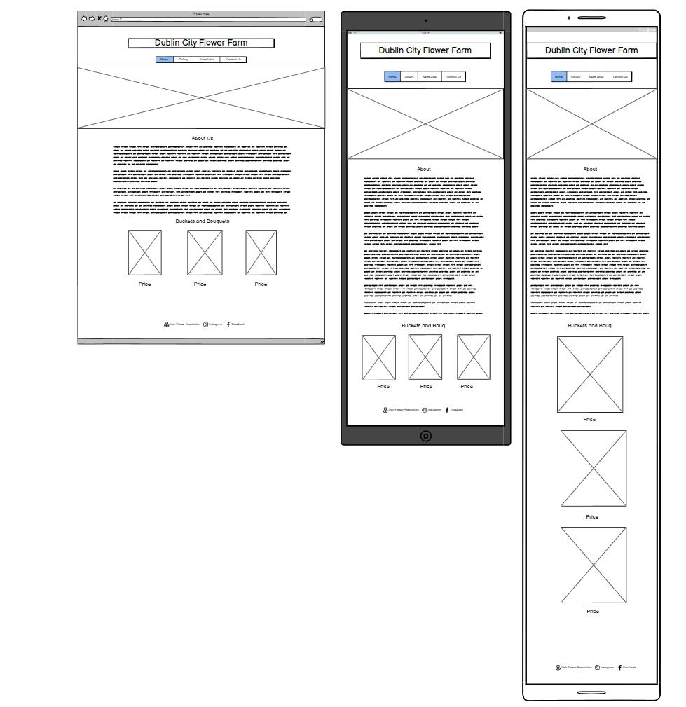
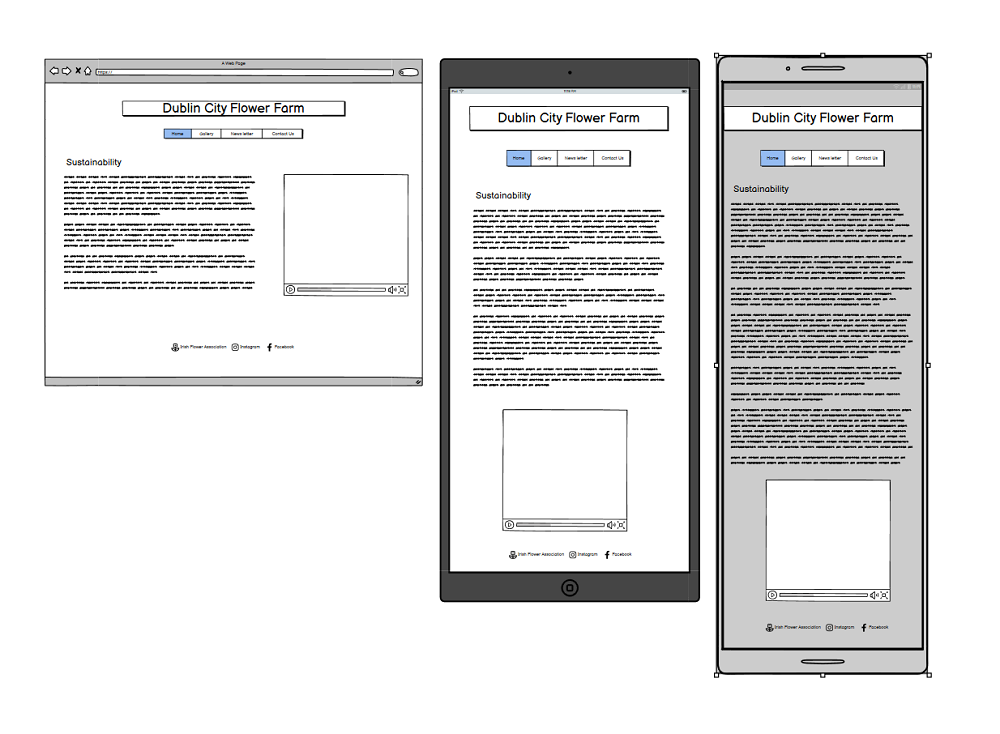
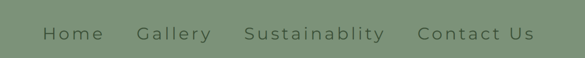

# Dublin City Flower Farm

This site is dedicated to helping the user get a feel for the kind of service that the Dublin City Flower Farm provides. It targets both professional florists and regular punters, giving them  information about who the company is and what they stand for. The site is also about networking and making conections with people, as the gardening world is a large place and it can be hard to find contacts.

# UX

As a new visitor to a site, I would like information on what the company is about, their products, and why I should we choose them. As a returning customer, I want to be able to easily navigate the site and quickily find what I'm looking for. I would also like the ability to contact the company directly through their website. 

# Design (UXD)

The User Experience Design was constructed using the five planes. 
+ Stratagy: Is this content relvent to the user and is it culturally appropriate?
+ Scope: Are we accomplishing our goals of broadcasting the companys ethos and products?
+ Structure: How many pages should we have in our website and why?
+ Skeleton: Does the structure of the wireframe meet the costumers/users needs? Is the web page responsive?    
+ Surface: Does the site look good visully? Does it have enough images and colours?

# Features 

## Logo

The text-based logo gives the user a clear indictation of what the site is and who it caters for. Clicking on the logo will also return you to the home page.

## Navagation bar

The navigation bar features on all four pages and is fully responsive. The logo also has a link to the home page when you click on it. The navigation bar is exactly the same on all pages to make the site more welcomeing and intuative. This section will alow the user to navagate through the website without having to use the back botton.

## Homepage image

The Homepage image with overlay text is colourful, to draw user's eye, and informative, giving the user an idea of the flowers are on offer. The overlay text give us a quote which is lyrical and poetic, suiting the aethetic of the brand.

## Bouquets and buckets

The bouquets and buckets section of the page shows images of sample boquets and their prices.  

## Footer

The footer includes links to social media, encourging the user to connect with the other platforms to better stay connected to the company. The links to the social media open up in new tabs to allow for ease of navigation.

## Gallery Page

The gallery will give the user a valuble insight into what the Dublin City flower farm has to offer in term of stock, and how the flowers are grown.

## Sustainablity Page

The sustainablity page gives the user an insight into the company's ethos. The text explains why you should buy flowers locally and not from abroad (i.e. not from the Netherlands). The video gives visual engagememt, showing the users the flower farm and the natural and sustainable way to farm flower.

## Contact Us Page

The contact us page allows for further engagement with the host. This page lets you sign up to the newsletter using a from, which will give the user a seasonal stock update and news of how the growing season is going. This page also gives users contact information for inquries. 

## Features to be added

Features that will be added include the ablity to place orders and pay on the site.

## Testing

+ I tested this website on differnt browers: Edge, Chrome, Firefox, and Safari.
+ The web page is responsive and looks great on all standard screen sizes using Devtools on Google Chrome.
+ I have made sure that all my headings and text are easy to read and understand.
+ I can confirm that the video does not auto play.
+ I can confirm that my form requires first name, last name, and an email adrress to be entered before it will be accepted.

## Bugs

When I first deployed my project to Github the images where not displaying.
+ I had to go back and change my file path diriectory and it worked!
At the moblie level, the website broke. All the content shrunk to half the size of the screen.
+ Removing the width at the mobile level fixed this problem.
Footer would not sick to the bottem on screens smaller then 400px. It kept moving up into the gallery photos.
+ The fix for this was the make the gallery content larger.

## Validation Testing

HTML
+ No errors were found when passing the website through the official W3C Validator.

CSS
+ No errors were found when passing the website through the official Jigsaw Validator.

Accessibility score
+ The colour and the font have good contrast and are easily readable as you can see by the 97% Accessibility score from Lighthouse in devtools.

## Deployment

The site was deployed using Github pages:
+ Go to github repositorys, click on the settings tab.
+ Click on pages in the bar on the left hand side.
+ Click on Branchs makes sure it set to main and click save.
+ Refresh the page and you will see a URL link to your page.

https://brionconroy.github.io/G_flower_shop/

## Credits

+ Thanks to the tutors at Coding instatute and to my mentor Anthony for guiding me through my first project. I would also like to thank Katie Duggan for proofreading the content.  

## Content
+ My gallery and form framework was taken from love running project.
+ My icons where taken from [Font Aswome](https://fontawesome.com/)
+ My font was taken from [Google Fonts](https://fonts.google.com/)
+ All my text content was writen by the client.
+ Making my web page more responsive. [Youtube](https://www.youtube.com/watch?v=WAIfQOR9bh4)

## Media 

+ All images and videos where given to my by the client.
